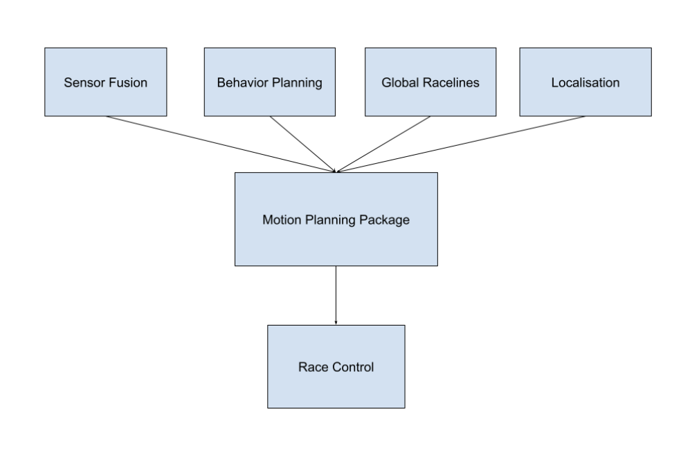

# Motion Planning for DSC 190 SP22

## Summary

The aim of the package is to return the fastest and most efficient path to overtake objects ahead safely and follow the optimal global raceline. This package was developed for the Winter 2022 edition of the DSC 190 (Intro to Robot Perception &amp; Navigation) class at UC San Diego. The package runs on python3 and is tested on a simulation of the 2.5 mile long Indiana Motor Speedway.

## Overview &amp; Framework

### Inputs

-Raceline - The optimal raceline also called the global raceline is the fastest and most efficient path to follow in a race. This is received as input to the package in a .csv format.

-Opponent Detection - Other race cars on the track are detected by fusing LiDAR depth perception and image recognition models. We get the following parameters for each opponent detected:

- X: x-coord on map
- Y: y-coord on map
- Theta: heading (which way the car is facing), 0.0 = North, 3.14/2 = West, etc.
- Type: should always be &#39;physical&#39; or &#39;car&#39;
- Form: basic shape of the object
- v\_x : velocity

Behavior - Behavior is the state of action that a car is currently in or would like to take. There are 4 different types of behavior executable by our package: Left, Right, Straight and Follow. It is calculated using the relative positions and relative velocity of opponent cars.

Output

Using the behavior selection algorithm, a behavior is selected. A trajector\_set with keys corresponding to action and values corresponding to trajectories is returned. The optimal behavior is selected from the trajectory\_set and published.

The following output is achieved, in this case the &#39;follow&#39; behavior was chosen from the trajectory set :

INSTALLATION

Any dependencies not already installed can be found in “requirements.txt” and installed in similar fashion as other python libraries. For example “pip install [package name]” 
This ROS package can be installed in the following way:

First you should navigate to the source folder of your catkin_ws or ros_ws. 
For example: cd ~/ros_ws/src.
Run:

git clone alexmak001/motion-path-planning-ros2 (github.com)
cd ..
colcon build

The motion planning package should be now installed to your computer and you will be able to use it after sourcing your workspace.

source /opt/ros/foxy/setup.bash

You can run the motion planning package by running:

ros2 launch motion_plan_pkg motion_plan_launch_file.launch.py

ROS API
Subscribed Topics

TrackedObjects(sensor_msgs/tracked_objects) - This would have been the custom sensor fusion topic we were going to subscribe to. For independent testing and usage purposes, our package uses dummy sensor data that provides a list of “obstacles” along our given race track.

geometry_msgs/PoseStamped - This subscription gives us the current position of our car so we know what position to begin generating each local path from. 

Published Topics
This node publishes a list of roughly 100-120 x and y coordinates relative to our race line graph for the race control team to follow. 

nav_msgs/Path - In this topic a path is published for the race control team to use to make our car move in the correct directions. 

Custom Messages
Originally, a custom message interface was created for the race control team to subscribe to and receive path updates; however, due to integration issues, simulation issues, and lack of time, we ultimately did not use the custom interface and went with the nav_msgs/Path pre-built message to output our paths.

Rviz markers
When opening Rviz, add a new topic, select Path and subscribe it to motion_plan.

In case that the pub_markers flag is set to true, this package publishes visualization messages, which can be displayed in Rviz. The following messages are published:

green line - The path should be continually updating and continually trace sections of your imported race line.

PARAMETERS

&quot;lidar\_frame&quot; (&quot;string&quot;, default: &quot;laser&quot;) - Name of the transformation frame (frame\_id) of the LaserScan msgs

&quot;world\_frame&quot; (&quot;string&quot;, default: &quot;world&quot;) - Name of the world coordinate frame, if it is not available, this value can be set equal to the lidar\_frame

&quot;threshold\_distance&quot; (&quot;double&quot;, default: &quot;0.2&quot;) - This value sets the distance that is used by the clustering algorithm

&quot;euclidean\_distance&quot; (&quot;double&quot;, default: &quot;0.25&quot;) - This value sets the distance that is used by the euclidean distasnce data association algorithm

&quot;pub\_markers&quot; (&quot;bool&quot;, default: &quot;false&quot;) - publish of the the vizualization markers

CHALLENGES FACED

One of the major challenges that we faced as a group was communication. It was sometimes a difficult task to share what you worked on or what you were able to accomplish with other team members and teams. We were sometimes only able to truly share information when we met in person, because remote meetings were not as effective. Also many people had to miss class due to COVID and made working in a group slightly more of a challenge, but was not a major issue.

Another challenge that we faced relating to communication was having specification and final deliverable changes. In the last week of the project, we decided that we would only combine with only two other teams. This forced us to be flexible, but also having to spend a lot of time in the lab in order to get our project working.

The most crucial part of this project was the selection of which algorithm we were going to use. We needed to find one that takes in the right format for the data and outputs in the format we need. It also has to be very efficient and quick to do calculations on the fly. After looking through a few, we found the one that we believed would work best and attempted to implement it in ROS2. However, the algorithm was huge and had a lot of moving parts. It took a while to figure out how it works, what we need from it, and how to implement it in ROS2.

The last major challenge we faced was not having a great way to test until the very last week of the project. Throughout the implementation, we could only debug with print statements to see that there is information flowing, but we did not know if it was correct. When we finally set up the simulation in the lab, we were able to visualize our outputs, but they were not the correct ones. Also, we found out that the sample data we had been using for our algorithm was not reflective of what we will be receiving during the race, so we had to figure out how to quickly format them.

Development

  - Week 6
    - Began exploring possible options for motion plan algorithms.
  - Week 7
    - Found motion plan algorithm and determined its inputs/outputs
    - Started figuring out ROS2 integration
  - Week 8
    - Implementing our algorithm into ROS2 and setting up subscriber and publisher nodes
  - Week 9
    - Integrating with other teams
  - Week 10
    - Debugging and testing in a simulation
